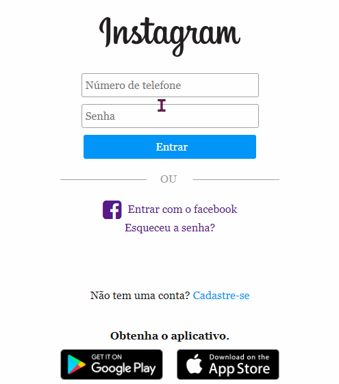
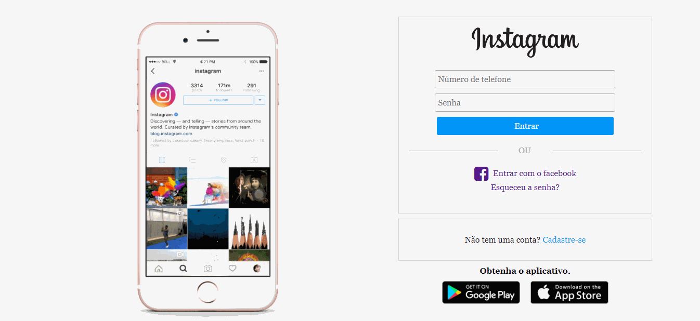

<h2>Sobre</h2>

Página inicial do instagram, desafio do bootcamp HTML Web Developer da Digital Innovation One.

<a href="https://clone-instagram-leandro.netlify.app/">Quere ver</a>

<h4 align="center"> 
	✅ INSTAGRAM 🚀  CONCLUÍDO ✅
</h4>

---

---

<h2> 📱 Demonstração  da tela 📱</h2>

<figure>
    <figcaption>Login celular</figcaption>
     
    
</figure>

<figure>
    <figcaption>Login desktop</figcaption>
     
    
</figure>

---

<h2> 🔨 Tecnologias utilizadas 🔨</h2>
<ul>
    <li>HTML5</li>
    <li>CSS3</li>
    <li>FLEXBOX</li>
</ul>

---

<h2>👷  Autor 👷 </h2>

Leandro Nascimento

